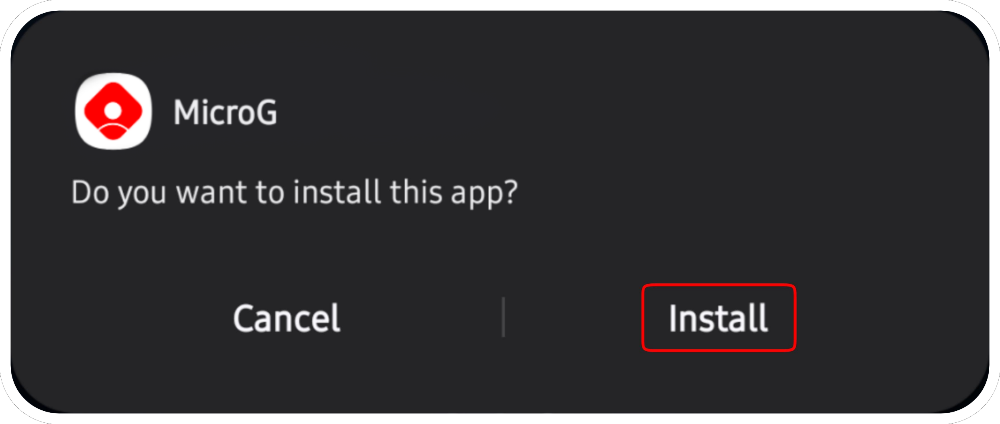
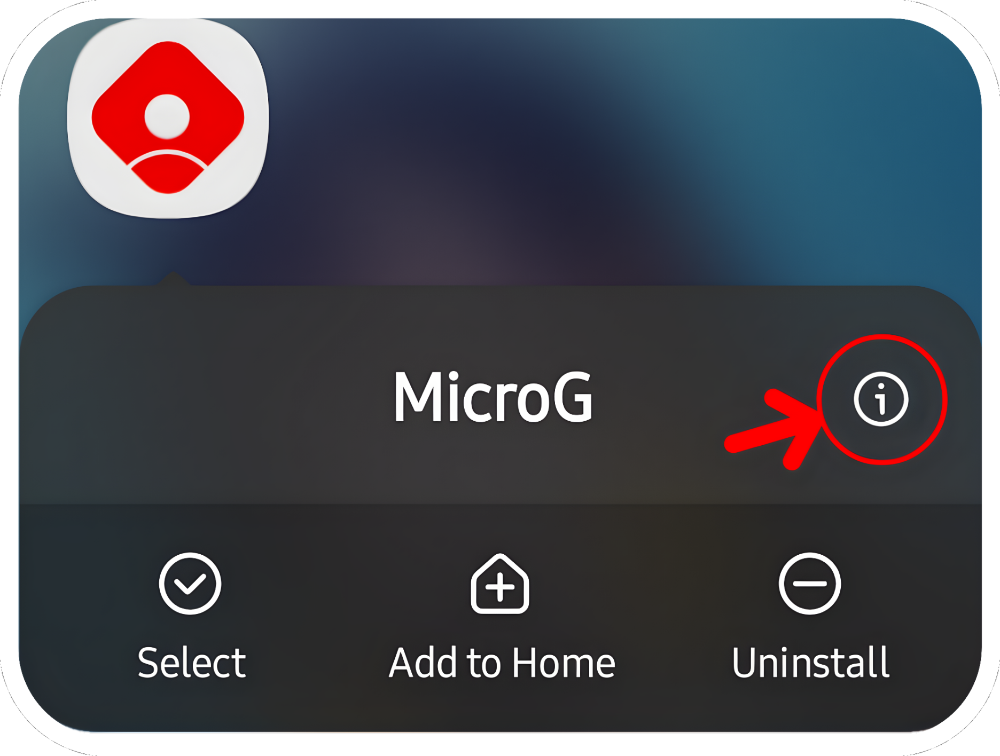

# <p align="center">How to install apps?

### For installing with ReVanced Manager, please [follow this tutorial](https://mega.nz/file/6aYFGaiY#wq5XcuzRE_rKYqp6M2QR-Jf2IkUlrlhnT1HRA6MHHP4)
Links: [ReVanced Manager](https://github.com/ReVanced/revanced-manager/releases/latest), [GMSCore](https://github.com/ReVanced/GmsCore/releases//latest).
#
### For installing with ReVancify, please [follow this tutorial](https://mega.nz/file/ubJATAYT#CkAE52hbndje9xH1toF1BNQq7LU0akK0AEKZ5PG3I9E)
Links: [Termux](https://github.com/KitsunedFox/termux-monet/releases/latest), [GMSCore](https://github.com/ReVanced/GmsCore/releases/latest).

Copy/Past this command: After installation, type ```revancify``` in termux and press enter.
```console
curl -sL "https://raw.githubusercontent.com/decipher3114/Revancify/main/install.sh" | bash
```
#
<p align="center"> For installing with this builder, please follow this tutorial.

#### <p align="center">Please note that the signatures are different from ReVanced Manager. You will not be able to install these applications without uninstalling the application patched by RV Manager first (remember to export your settings before uninstalling it) (you can however update the applications present here, the signatures do not change).
#

<p align="center">Go to the Extended.Builder main page and scroll down https://github.com/kevinr99089/Extended.Builder :

<p align="center">and click on the latest releases :

<p align="center">Scroll down the page again and click on the application you want (For my exemple, YT-ReReX), then on GMSCore. You need GMSCore/MicroG to use YT/Music:

<p align="center"> and click on app.revanced.android.gms-xxxxxxxxx-signed.apk :


---

<p align="center">This step is optional, but if the applications refuse to install, it's possible that Play Protect is blocking the installation. In this case, and only in this case, follow this step.
<p align="center">Go to Play Store, click on your profile picture and press :

<p align="center">click on "No harmful apps found"

<p align="center">Click on the gear at the top right of the screen :

<p align="center">and disable "Scan apps with Play Protect" :

<p align="center">If you had to disable it to install these applications, reactivate it once all the steps are finished.

---

<p align="center">click (in the notification bar) on app.revanced.android.[...].apk first

<p align="center">if you have never installed applications from the Web, you need to Enable in the settings "Unknown Sources"

<p align="center">and allow permission for install apps :

<p align="center">Another pop-up will appear, click on "install".

<p align="center">Once microG Services is installed, click on OK and click on YT-ReReX (in the notification bar) and click on "Install"

<p align="center">Once done, Go to Home screen (or Settings > Apps), and go to microG Services settings :

<p align="center"> Go to permissions settings :

<p align="center">and enable everything :

<p align="center">Return to the previous menu and disable battery optimizations :

<p align="center">and you're done. In YT-ReReX, click on the top right corner and click on "+" to sign in to your Google account.
