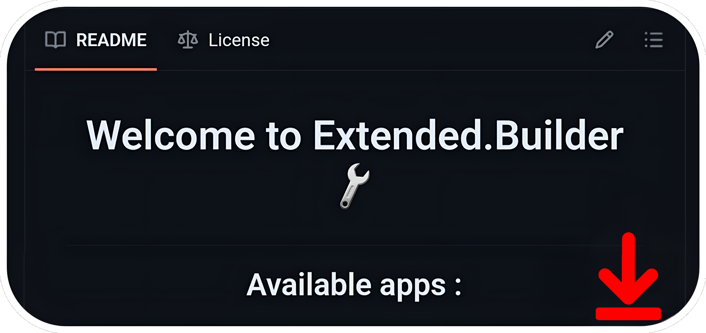
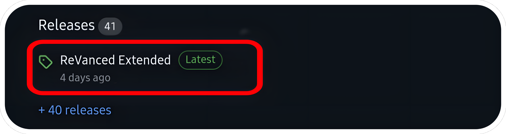
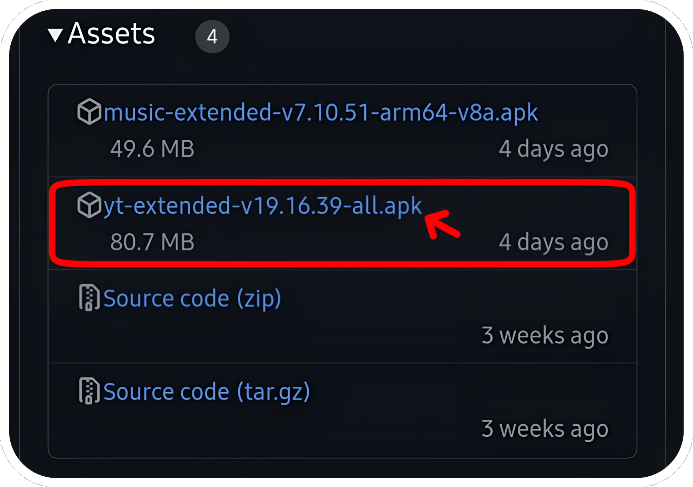
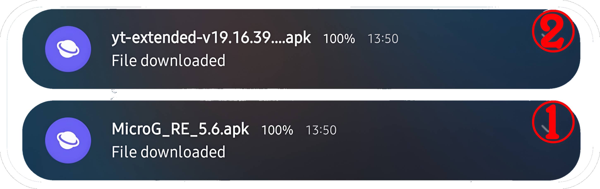

# <p align="center">How to install apps?
#### <p align="center">Please note that the signatures are different from ReVanced Manager. You will not be able to install these applications without uninstalling the application patched by RV Manager first (remember to export your settings before uninstalling it) (you can however update the applications present here, the signatures do not change).
#

### For installing with ReVanced Manager, please [follow this tutorial](https://mega.nz/file/7LxyjQwT#pVQ8jA_LKUhjAnz6KbfPLsp0wh2QfivGHHkPHFBZPxs)
Links: [ReVanced Manager](https://github.com/ReVanced/revanced-manager/releases/latest), [MicroG](https://github.com/WSTxda/MicroG-RE/releases/latest).
#
### For installing with ReVancify, please [follow this tutorial](https://mega.nz/file/DOYkjZIT#eOBU1Ken6zVLloONCN-gvocBTSxpJ02C4LkdrnJoN04)
Links: [Termux](https://github.com/KitsunedFox/termux-monet/releases/latest), [MicroG](https://github.com/WSTxda/MicroG-RE/releases/latest).

Copy/Past this command: After installation, type ```revancify``` in termux and press enter.
```console
curl -sL "https://raw.githubusercontent.com/decipher3114/Revancify/main/install.sh" | bash
```
#
<p align="center"> For installing with this builder, please follow this tutorial.

Scroll to the bottom of the [main page](https://github.com/kevinr99089/Extended.Builder)
    

<p align="center">and click on the latest release:
    

<p align="center">Scroll again to the bottom of the page and click on the release you want to download (For my exemple, YT-Extended) and an Microg. For non-rooted devices, MicroG is required to use YT.
    

<p align="center"> and click on microg.apk
   

---

<p align="center">This step is optional, but if the applications refuse to install, it is possible that Google Play Protect is preventing the installation. In these cases, and only in these cases, follow this step.
<p align="center">Go to the Google Play Store, click on your profile picture and press:
    
<p align="center">click on "No harmful apps found"
    

<p align="center">Click on the gear at the top right of the screen
    

<p align="center">and disable "Scan apps with Play Protect".
    

<p align="center">If you had to disable it to install these applications, reactivate it once all the steps are finished.

---

<p align="center">click (in the notification bar) on microg.apk first
    

<p align="center">if you have never installed applications from the Web, you will have to Enable in the settings "Unknown Sources"
    

<p align="center">and check the browser that allowed you to download it
    

<p align="center">Another pop-up will appear, 
click on "install".
    

<p align="center">Once MicroG is installed, click on OK and click on YT-Extended (in the notification bar) and click on "Install"

<p align="center">and you're done. In YT-Extended, click on the top right corner and click on "+" to sign in to your Google account.
