# <p align="center">How to Install Applications?

### To install with ReVanced Manager, please [follow this tutorial](https://mega.nz/file/3SAjiIxQ#0dWhhwk5TIEMRz4jct2ztZA1w-bbotf8tEBEzxd1C1Y)

Links: [ReVanced Manager](https://github.com/inotia00/revanced-manager/releases/latest), [MicroG](https://github.com/WSTxda/MicroG-RE/releases/latest).

---

### To install with ReVancify, please [follow this tutorial](https://mega.nz/file/vaoTALpD#6ZMQ6DpYWIbXPu6u_s0X5MghSS_J26duI574NCNa8ME)

Links: [Termux](https://github.com/termux/termux-app/releases/latest), [MicroG](https://github.com/WSTxda/MicroG-RE/releases/latest).

Copy/Past this command:
```console
curl -sL "https://raw.githubusercontent.com/decipher3114/Revancify/main/install.sh" | bash
```
After installation, type `revancify` in Termux and press Enter.

---

#
### To install with this builder, please [follow this tutorial](https://github.com/Kevinr99089/Extended.Builder/blob/main/install.md#for-installing-with-this-builder-please-follow-this-tutorial)

> **Signatures differ from ReVanced Manager. You must uninstall the app patched by RV Manager to use versions from the methods below (export your settings before uninstalling).**

---

<details>
  <summary>Without automatic updates</summary>

Visit the [Releases](https://github.com/kevinr99089/Extended.Builder) page, scroll down, and click on the desired app (e.g., YT-Extended), then on [MicroG-RE](https://github.com/WSTxda/MicroG-RE/releases/latest) (necessary for these mods):


and click on MicroG_RE_x.x.apk:

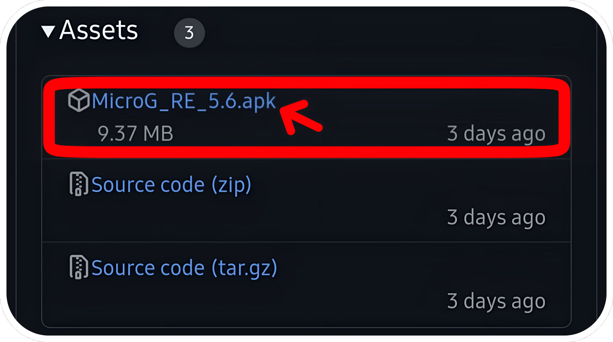

---

<details>
      <summary>
Disabling Play Protect is required, *only if* the app refuses to install.</summary>

Go to the Play Store, click your profile picture in the top-right corner, then "Manage apps and device":


then click on "No harmful apps found":


Click the settings icon at the top-right of the screen:


and disable "Scan apps with Play Protect":


Remember to re-enable it after installing apps.

</details>

<details>
      <summary>
If you've never installed an app from the web</summary>

First, install MicroG_RE_X.X.apk from the notification bar, then yt-extended-vxx.xx.xx-all.apk:


Click the app you just downloaded in the notification bar. If you've never installed apps from the web, you'll need to enable "Unknown Sources" in settings:


and grant the required permission: 


then proceed to install the app:


Once MicroG services are installed, click OK, then open YT-Extended (from the notification bar) and click "Install":

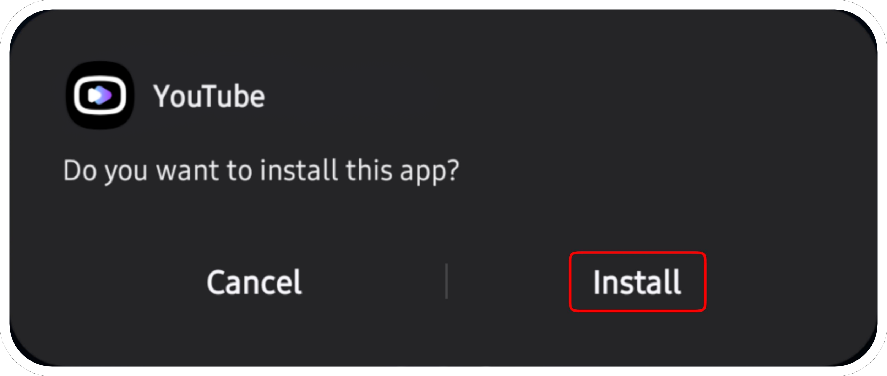
</details>

---

After installing these apps, go to your home screen (or Settings > Apps), then open MicroG settings:


Go to Permissions:

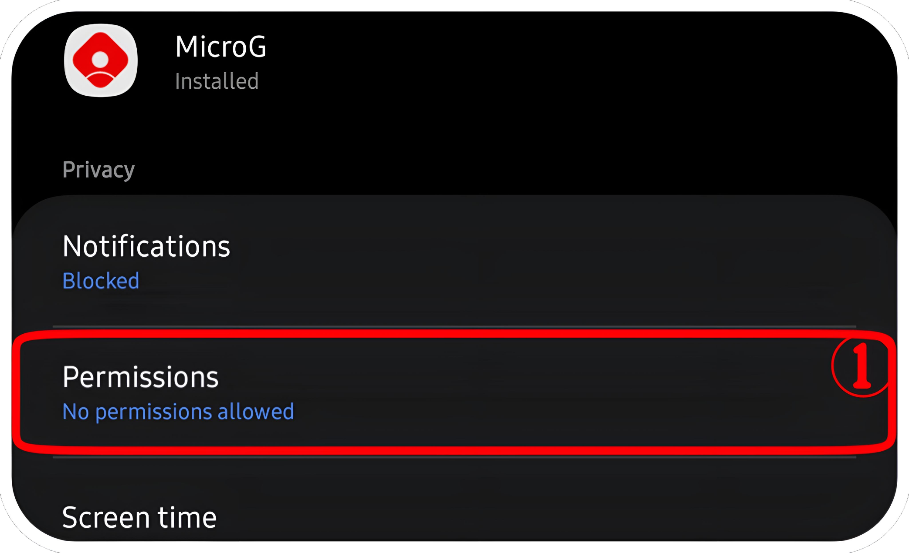

and enable everything:


Go back to the previous menu, then go to Battery:


and set the app to "Unrestricted":


You're all set! Now, open YT, go to the library, and click "+" to log into your Google account.

</details>
<details>
    <summary>Automatic Updates (Obtainium)</summary>

> This installation method was inspired by peternmuller, [support his work](https://github.com/kevinr99089/Extended.Builder/?tab=readme-ov-file#-thanks-to-).

#

If you'd like to use Obtainium to easily manage apps and updates, you can download it here:

[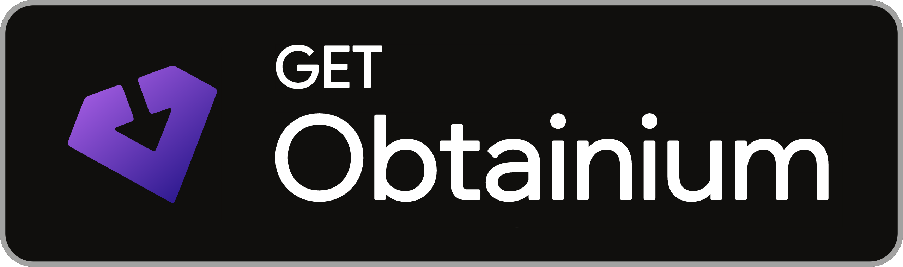](https://github.com/ImranR98/Obtainium/releases/latest/download/app-release.apk)

<details>
      <summary>
Disabling Play Protect is required, *only if* the app refuses to install.</summary>

Go to the Play Store, click your profile picture in the top-right corner, then "Manage apps and device":


then click on "No harmful apps found":


Click the settings icon at the top-right of the screen:


and disable "Scan apps with Play Protect":


Remember to re-enable it after installing apps.

</details>

<details>
      <summary>
If you've never installed an app from the web</summary>
Click the app you just downloaded in the notification bar. If you've never installed apps from the web, you'll need to enable "Unknown Sources" in settings:


and grant the required permission: 


then proceed to install the app:


</details>

---
<details>
    <summary>Pre-configured</summary>

Once installed, select the application for which you wish to add a pre-configuration. RVX is highly recommended. (MicroG is required to use RVX, RVX Latest, and/or RVX Music.)

[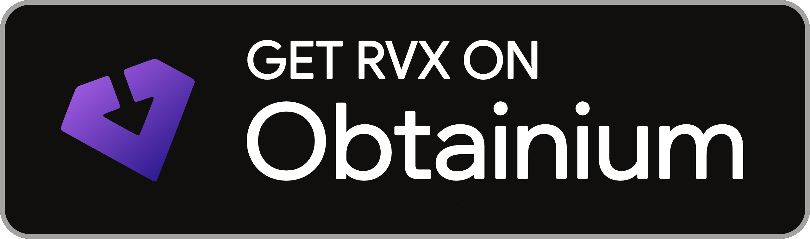](https://apps.obtainium.imranr.dev/redirect?r=obtainium://app/%7B%22id%22%3A%22app.rvx.android.youtube%22%2C%22url%22%3A%22https%3A%2F%2Fgithub.com%2Fkevinr99089%2FExtended.Builder%22%2C%22author%22%3A%22kevinr99089%22%2C%22name%22%3A%22YouTube%22%2C%22preferredApkIndex%22%3A0%2C%22additionalSettings%22%3A%22%7B%5C%22includePrereleases%5C%22%3Afalse%2C%5C%22fallbackToOlderReleases%5C%22%3Atrue%2C%5C%22filterReleaseTitlesByRegEx%5C%22%3A%5C%22%5C%22%2C%5C%22filterReleaseNotesByRegEx%5C%22%3A%5C%22%5C%22%2C%5C%22verifyLatestTag%5C%22%3Atrue%2C%5C%22dontSortReleasesList%5C%22%3Afalse%2C%5C%22useLatestAssetDateAsReleaseDate%5C%22%3Afalse%2C%5C%22releaseTitleAsVersion%5C%22%3Afalse%2C%5C%22trackOnly%5C%22%3Afalse%2C%5C%22versionExtractionRegEx%5C%22%3A%5C%22%5C%22%2C%5C%22matchGroupToUse%5C%22%3A%5C%22%5C%22%2C%5C%22versionDetection%5C%22%3Afalse%2C%5C%22releaseDateAsVersion%5C%22%3Afalse%2C%5C%22useVersionCodeAsOSVersion%5C%22%3Afalse%2C%5C%22apkFilterRegEx%5C%22%3A%5C%22yt-extended%5C%22%2C%5C%22invertAPKFilter%5C%22%3Afalse%2C%5C%22autoApkFilterByArch%5C%22%3Afalse%2C%5C%22appName%5C%22%3A%5C%22RVX%5C%22%2C%5C%22shizukuPretendToBeGooglePlay%5C%22%3Afalse%2C%5C%22allowInsecure%5C%22%3Afalse%2C%5C%22exemptFromBackgroundUpdates%5C%22%3Afalse%2C%5C%22skipUpdateNotifications%5C%22%3Afalse%2C%5C%22about%5C%22%3A%5C%22%5C%22%7D%22%2C%22overrideSource%22%3Anull%7D)
[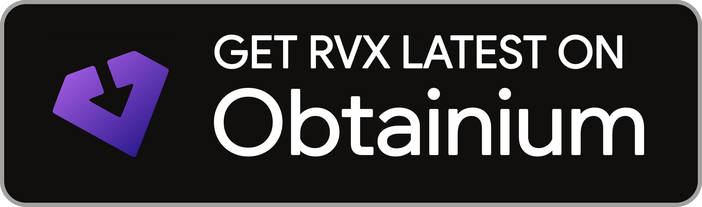](https://apps.obtainium.imranr.dev/redirect?r=obtainium://app/%7B%22id%22%3A%22app.rvx.android.youtube%22%2C%22url%22%3A%22https%3A%2F%2Fgithub.com%2Fkevinr99089%2FExtended.Builder%22%2C%22author%22%3A%22kevinr99089%22%2C%22name%22%3A%22YouTube%22%2C%22preferredApkIndex%22%3A0%2C%22additionalSettings%22%3A%22%7B%5C%22includePrereleases%5C%22%3Afalse%2C%5C%22fallbackToOlderReleases%5C%22%3Atrue%2C%5C%22filterReleaseTitlesByRegEx%5C%22%3A%5C%22%5C%22%2C%5C%22filterReleaseNotesByRegEx%5C%22%3A%5C%22%5C%22%2C%5C%22verifyLatestTag%5C%22%3Atrue%2C%5C%22dontSortReleasesList%5C%22%3Afalse%2C%5C%22useLatestAssetDateAsReleaseDate%5C%22%3Afalse%2C%5C%22releaseTitleAsVersion%5C%22%3Afalse%2C%5C%22trackOnly%5C%22%3Afalse%2C%5C%22versionExtractionRegEx%5C%22%3A%5C%22%5C%22%2C%5C%22matchGroupToUse%5C%22%3A%5C%22%5C%22%2C%5C%22versionDetection%5C%22%3Afalse%2C%5C%22releaseDateAsVersion%5C%22%3Afalse%2C%5C%22useVersionCodeAsOSVersion%5C%22%3Afalse%2C%5C%22apkFilterRegEx%5C%22%3A%5C%22yt_latest_support%5C%22%2C%5C%22invertAPKFilter%5C%22%3Afalse%2C%5C%22autoApkFilterByArch%5C%22%3Afalse%2C%5C%22appName%5C%22%3A%5C%22RVX%5C%22%2C%5C%22shizukuPretendToBeGooglePlay%5C%22%3Afalse%2C%5C%22allowInsecure%5C%22%3Afalse%2C%5C%22exemptFromBackgroundUpdates%5C%22%3Afalse%2C%5C%22skipUpdateNotifications%5C%22%3Afalse%2C%5C%22about%5C%22%3A%5C%22%5C%22%7D%22%2C%22overrideSource%22%3Anull%7D)

[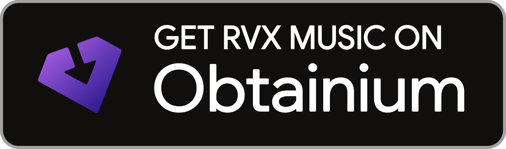](https://apps.obtainium.imranr.dev/redirect?r=obtainium://app/%7B%22id%22%3A%22app.rvx.android.apps.youtube.music%22%2C%22url%22%3A%22https%3A%2F%2Fgithub.com%2FKevinr99089%2FExtended.Builder%22%2C%22author%22%3A%22Kevinr99089%22%2C%22name%22%3A%22YouTube%C2%A0Music%22%2C%22preferredApkIndex%22%3A0%2C%22additionalSettings%22%3A%22%7B%5C%22includePrereleases%5C%22%3Afalse%2C%5C%22fallbackToOlderReleases%5C%22%3Atrue%2C%5C%22filterReleaseTitlesByRegEx%5C%22%3A%5C%22%5C%22%2C%5C%22filterReleaseNotesByRegEx%5C%22%3A%5C%22%5C%22%2C%5C%22verifyLatestTag%5C%22%3Atrue%2C%5C%22dontSortReleasesList%5C%22%3Afalse%2C%5C%22useLatestAssetDateAsReleaseDate%5C%22%3Afalse%2C%5C%22releaseTitleAsVersion%5C%22%3Afalse%2C%5C%22trackOnly%5C%22%3Afalse%2C%5C%22versionExtractionRegEx%5C%22%3A%5C%22%5C%22%2C%5C%22matchGroupToUse%5C%22%3A%5C%22%5C%22%2C%5C%22versionDetection%5C%22%3Afalse%2C%5C%22releaseDateAsVersion%5C%22%3Afalse%2C%5C%22useVersionCodeAsOSVersion%5C%22%3Afalse%2C%5C%22apkFilterRegEx%5C%22%3A%5C%22music-extended%5C%22%2C%5C%22invertAPKFilter%5C%22%3Afalse%2C%5C%22autoApkFilterByArch%5C%22%3Atrue%2C%5C%22appName%5C%22%3A%5C%22RVX%20Music%5C%22%2C%5C%22shizukuPretendToBeGooglePlay%5C%22%3Afalse%2C%5C%22allowInsecure%5C%22%3Afalse%2C%5C%22exemptFromBackgroundUpdates%5C%22%3Afalse%2C%5C%22skipUpdateNotifications%5C%22%3Afalse%2C%5C%22about%5C%22%3A%5C%22%5C%22%7D%22%2C%22overrideSource%22%3Anull%7D) [](https://apps.obtainium.imranr.dev/redirect?r=obtainium://app/%7B%22id%22%3A%22app.revanced.android.gms%22%2C%22url%22%3A%22https%3A%2F%2Fgithub.com%2FWSTxda%2FMicroG-RE%22%2C%22author%22%3A%22WSTxda%22%2C%22name%22%3A%22MicroG%22%2C%22preferredApkIndex%22%3A0%2C%22additionalSettings%22%3A%22%7B%5C%22includePrereleases%5C%22%3Afalse%2C%5C%22fallbackToOlderReleases%5C%22%3Atrue%2C%5C%22filterReleaseTitlesByRegEx%5C%22%3A%5C%22%5C%22%2C%5C%22filterReleaseNotesByRegEx%5C%22%3A%5C%22%5C%22%2C%5C%22verifyLatestTag%5C%22%3Atrue%2C%5C%22dontSortReleasesList%5C%22%3Afalse%2C%5C%22useLatestAssetDateAsReleaseDate%5C%22%3Afalse%2C%5C%22releaseTitleAsVersion%5C%22%3Afalse%2C%5C%22trackOnly%5C%22%3Afalse%2C%5C%22versionExtractionRegEx%5C%22%3A%5C%22%5C%22%2C%5C%22matchGroupToUse%5C%22%3A%5C%22%5C%22%2C%5C%22versionDetection%5C%22%3Afalse%2C%5C%22releaseDateAsVersion%5C%22%3Afalse%2C%5C%22useVersionCodeAsOSVersion%5C%22%3Afalse%2C%5C%22apkFilterRegEx%5C%22%3A%5C%22MicroG_RE%5C%22%2C%5C%22invertAPKFilter%5C%22%3Afalse%2C%5C%22autoApkFilterByArch%5C%22%3Atrue%2C%5C%22appName%5C%22%3A%5C%22MicroG-RE%20(GMSCore)%5C%22%2C%5C%22shizukuPretendToBeGooglePlay%5C%22%3Afalse%2C%5C%22allowInsecure%5C%22%3Afalse%2C%5C%22exemptFromBackgroundUpdates%5C%22%3Afalse%2C%5C%22skipUpdateNotifications%5C%22%3Afalse%2C%5C%22about%5C%22%3A%5C%22%5C%22%7D%22%2C%22overrideSource%22%3Anull%7D)

Perfect, these applications are ready to install. Just click on the download icon and install these applications:
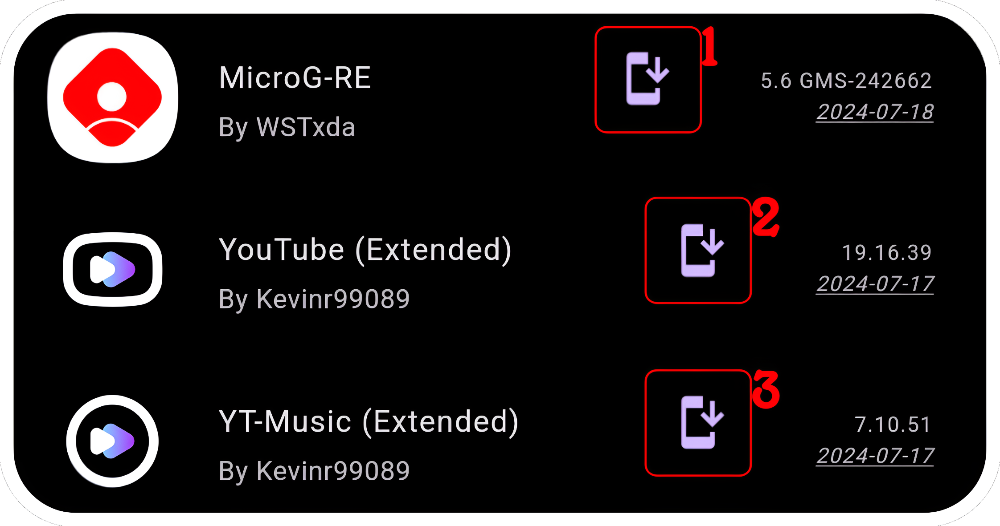

After installing these apps, go to your home screen (or Settings > Apps), then open MicroG settings:


Go to Permissions:


and enable everything :


Go back to the previous menu, then go to Battery: 


and set the app to "Unrestricted":


You're all set! Now, open YT, go to the library, and click "+" to log into your Google account.

---
</details>

<details>
   <summary>Manual configuration</summary>
Once installed, open Obtainium. The application may look complicated, but it's not.  
Click on **Add App**, and paste this link into **App Source URL**:

  ```console
https://www.github.com/Kevinr99089/Extended.Builder
```


Once pasted, settings will open. Check "Verify the 'latest' tag":


Scroll a little further, and in **"Regular Expression"**, type "yt-extended", uncheck **"Attempt to filter APKs by CPU architecture if possible"**, and type the name you want (optional):

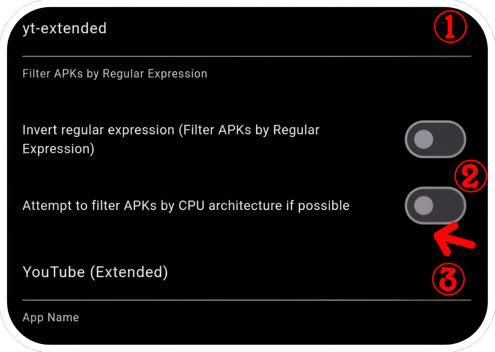

Scroll up again and click on **"Add"**:

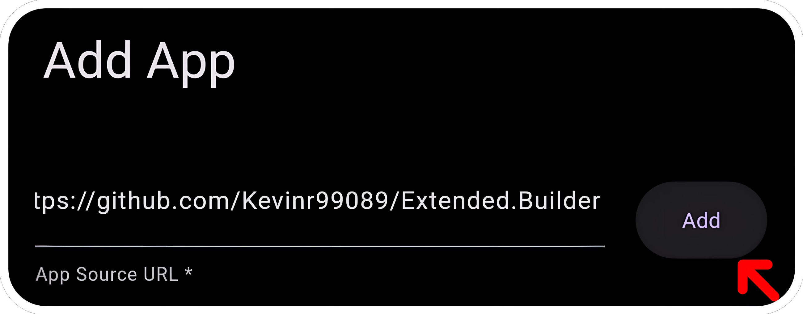

<details>
    <summary>Install YT-Music (optional)</summary>

Click again on "Add App", and paste this link into App Source URL *:
```console
https://www.github.com/Kevinr99089/Extended.Builder
```
Check again "Verify the 'latest' tag":


Scroll down and in "Regular Expression", type "music-extended", check "Attempt to filter APKs by CPU architecture if possible", and type the name you want (optional):

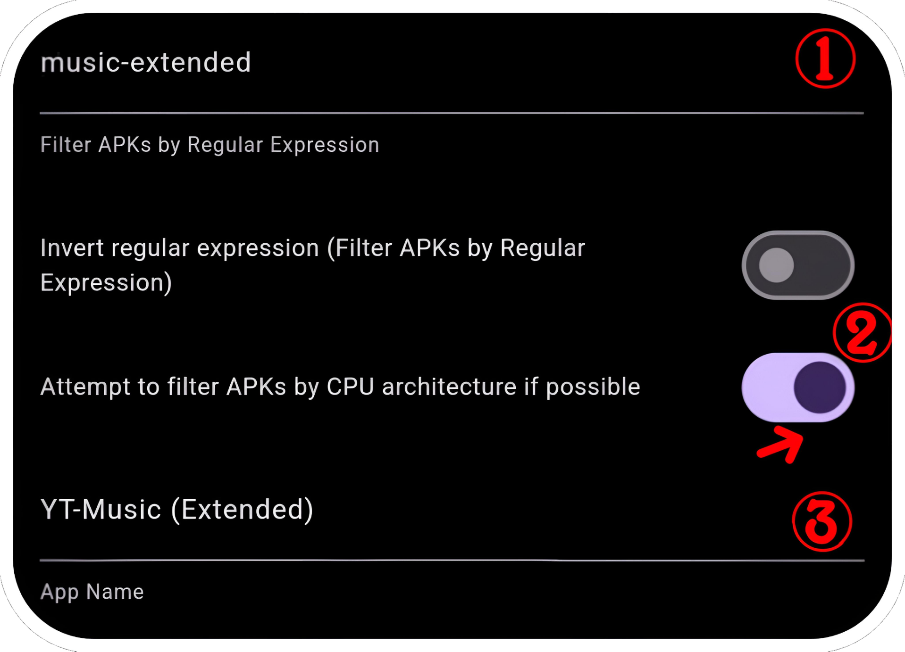

Scroll up and click on "Add":


</details>

Click for the last time on "Add App", and paste this link into App Source URL *:
```console
https://github.com/WSTxda/MicroG-RE
```
Check "Verify the 'latest' tag":


Since this release has only one application, don’t set "Regular Expressions", uncheck "Attempt to filter APKs by CPU architecture if possible", and type the name you want (optional):


Then type "Add":


Perfect, these applications are ready to install. Just click on the download icon for the applications:


After installing these apps, go to your home screen (or Settings > Apps), then open MicroG settings:


Go to Permissions:


and enable everything:


Go back to the previous menu, then go to Battery: 


and set the app to "Unrestricted":


You're all set! Now, open YT, go to the library, and click "+" to log into your Google account.

---
</details>

<details>
    <summary>About Regular Expressions in Obtainium</summary>

Regular expressions are used in Obtainium to filter applications in releases, which is especially useful when multiple APKs are available in a release.

**Q: What are regular expressions?**

**A:** Regular expressions allow you to specify patterns to filter applications. This is particularly helpful when a release contains multiple applications:

  

In this example, there are two applications: `yt-extended` and `music-extended`.
If you use `yt-extended` as the regular expression, Obtainium will suggest all applications that match this pattern. Alternatively, it will automatically select and download `yt-extended` without prompting you during each release. By enabling **"Invert regular expression"**, it will suggest all applications that **do not** contain `yt-extended` in their name. In this case, `music-extended` will be the default selection.

However, avoid using the application version as a regular expression because, with updates, the specific version may no longer be available.

More information here: [Obtainium Wiki](https://wiki.obtainium.imranr.dev/) .

Aside from regular expressions, Obtainium simplifies installation, checks for updates at regular intervals (based on your settings), and sends notifications when updates are available for your apps. You can also use it in combination with Shizuku to automate update installations. Note that if there are multiple releases, automatic installation may not occur.
</details>
